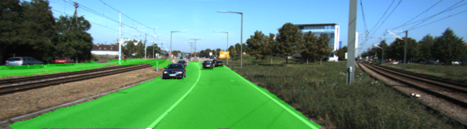
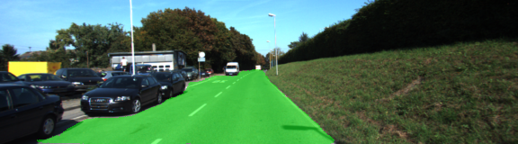
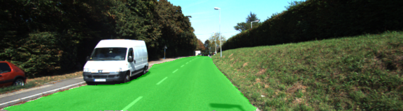
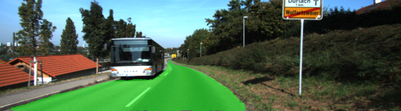
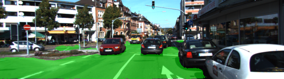
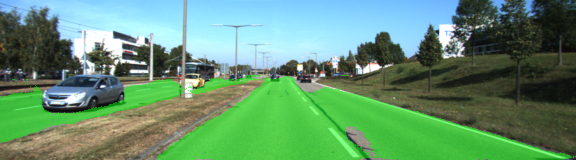
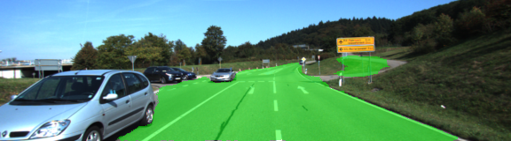
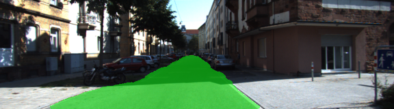
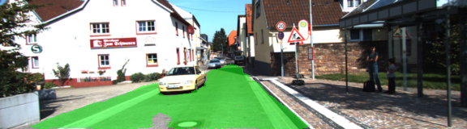

# Semantic Segmentation
### Introduction
In this project, you'll label the pixels of a road in images using a Fully Convolutional Network (FCN).

### Context
#### Kitti Road dataset
The [Kitti Road dataset](http://www.cvlibs.net/datasets/kitti/eval_road.php) provides training data as a set of urban road images and labels in the form of corresponding images where the lanes and roads have been manually marked. It also provides a set of testing data without ground truth. We use this to train our FCN and test its inference on the testing data.

#### VGG16 model
[VGG16](https://arxiv.org/abs/1409.1556) is a convolutional neural network model used in the [ImageNet challenge](http://image-net.org/challenges/LSVRC/2015/index) for classifying images into one of 1000 classes. In this project, we take the pretrained VGG model and try to reuse its first convolutional stage as the encoder for our FCN

### Model
#### Encoder
We pick three layers from the VGG model which are expected to provide us with useful features - Layer 3, Layer 4, Layer 7. As we go deeper with layers, we gain more semantic information, but lose locality information. For example, if we were to predict only based on Layer 7 features, we would get only coarse predictions:


Instead, we create "skip layers" from shallow layers which give finer predictions:



In order to incorporate the tensors from the various layers, we first upsample Layer 7 and Layer 4 by a 4x and 2x transpose convolution respectively. After an addition of the result with Layer 3, we have our encoded feature spectrum with 256 channels.

#### Decoder
The decoder part of the FCN involves upsampling the encoded features to the original image size by running a transpose convolution with 256 input channels and 2 output channels, representing the "road" and "not-road" predictions. All layers are configured with an normal initializer that provides weights with a standard-deviation of `0.01` and a regularizer to penalize large weights.

#### Training
The final decoded layer is reshaped into a 2D tensor and its cross-entropy is calculated against the manually annotated image. We use an Adam optimizer to minimize the cross-entropy loss. The learning-rate was set at a constant value of 0.0001 and keep-probability at 0.5. The dropout layers, along with regularization prevent overfitting. The loss reduced to `0.25` by epoch 4 and to `0.12` by epoch 10.

##### Hyperparameters

Learning-rate: 0.0001 (constant)
Keep probability: 0.5
Batch-size: 30
Epochs: 15

#### Inference
Inference is made by subjecting the output layer to a softmax function, slicing out only the `road` class values, thresholding those values to be above `0.5`. This tensor provides the mask representing road pixels and can be overlapped onto the image.

### Results
The results show significant quality around epoch 5 and keep improving upto epoch 15

#### Samples
The model performs well for separating roads and even detects multiple lanes and avoids vehicles on the road

|                            |                             |                             |                               |
|----------------------------|-----------------------------|-----------------------------|-------------------------------|
| |  |  |    |
|| |  |    |


#### Reflections
- Cost falls down drastically after a couple of epochs and keeps improving with more epochs. Perhaps, more epochs than 15 could improve results further
- The model could be improved by balancing the data better by augmentation
- Shadows pose a minor issue, so image normalization might also help


### Setup
##### Frameworks and Packages
Make sure you have the following is installed:
 - [Python 3](https://www.python.org/)
 - [TensorFlow](https://www.tensorflow.org/)
 - [NumPy](http://www.numpy.org/)
 - [SciPy](https://www.scipy.org/)
##### Dataset
Download the [Kitti Road dataset](http://www.cvlibs.net/datasets/kitti/eval_road.php) from [here](http://www.cvlibs.net/download.php?file=data_road.zip).  Extract the dataset in the `data` folder.  This will create the folder `data_road` with all the training a test images.

### Start
##### Implement
Implement the code in the `main.py` module indicated by the "TODO" comments.
The comments indicated with "OPTIONAL" tag are not required to complete.
##### Run
Run the following command to run the project:
```
python main.py
```
**Note** If running this in Jupyter Notebook system messages, such as those regarding test status, may appear in the terminal rather than the notebook.

### Submission
1. Ensure you've passed all the unit tests.
2. Ensure you pass all points on [the rubric](https://review.udacity.com/#!/rubrics/989/view).
3. Submit the following in a zip file.
 - `helper.py`
 - `main.py`
 - `project_tests.py`
 - Newest inference images from `runs` folder
 
 ## How to write a README
A well written README file can enhance your project and portfolio.  Develop your abilities to create professional README files by completing [this free course](https://www.udacity.com/course/writing-readmes--ud777).
